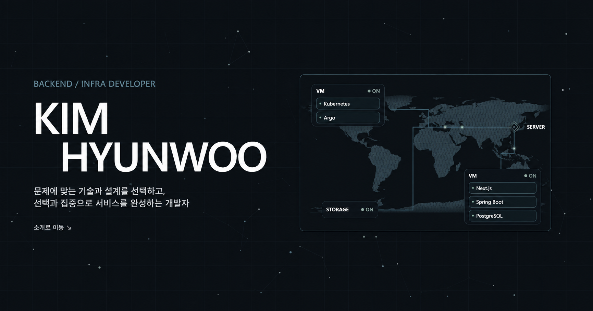

# Portfolio



개인 포트폴리오 콘텐츠를 직접 관리하고 공개하는 운영형 개인 웹 플랫폼입니다.

서비스: [https://khuoo.com](https://khuoo.com)

## 프로젝트 개요

- 개인 웹 포트폴리오 프로젝트
- 포트폴리오, 프로젝트 등 admin페이지로 직접 관리가 가능하도록 구성
- Tools 기능 제공으로 등인된 유저에 한하여 학업 및 프로젝트 레퍼런스 등 유용한 도구 제공

## 기술 스택

### 프론트엔드

<p>
  
</p>

### 백엔드

<p>
  
</p>

### 데이터베이스

<p>
  
</p>

### 인프라

<p>
  
</p>

### 주요 버전

| 기술        | 버전    |
| ----------- | ------- |
| Node.js     | 24.19.0 |
| Next.js     | 16.3.2  |
| React       | 19.2.8  |
| Java        | 21      |
| Spring Boot | 4.1.1   |
| PostgreSQL  | 16      |

## 주요 기능

| 영역          | 주요 기능                                                                      |
| ------------- | ------------------------------------------------------------------------------ |
| 포트폴리오    | 소개, 기술 스택, 프로젝트, 학력 및 성과, 반응형 화면, Light/Dark Theme         |
| 프로젝트 상세 | `/projects/{slug}` 기반 상세 페이지, 기술·성과·Architecture·Carousel           |
| 인증          | Email/Password 로그인, Server Session, USER/ADMIN 권한, 관리자 Email Challenge |
| 관리자        | Site, Projects, Accounts, Tools, Dashboard, Logs, Monitoring 관리              |
| 도구          | Quiz 문제 Import·풀이·저장, Reference/My Services Links                        |
| 운영          | 방문 분석, 서비스 Health Monitoring, HTTP 5xx 및 Trace ID 기반 오류 확인       |
| 파일 저장     | Resume, Link Image, Project Media Persistent Storage                           |

## CI/CD 및 배포

```text
feature/* → develop (DEV) → main (PROD)
```

- PR에서 Frontend / Backend CI 수행
- Frontend: lint · typecheck · Vitest · production build
- Backend: Gradle build · Testcontainers PostgreSQL 기반 테스트
- GitHub Actions에서 Docker Image Build 후 GHCR에 `sha-{commit}` Image 저장
- Linux Self-hosted Runner와 Docker Compose를 이용해 DEV / PROD 배포
- Health Check · Smoke Test 수행 및 실패 시 직전 정상 Image로 Rollback

## 로컬 실행

환경 변수가 설정된 로컬 환경을 기준으로 PostgreSQL, Backend, Frontend를 각각 실행합니다.

### 1. PostgreSQL

```bash
docker compose --env-file .env -f infra/compose.local.yaml up -d
```

### 2. Backend

Linux / macOS:

```bash
cd backend
./gradlew bootRun
```

Windows:

```powershell
cd backend
.\gradlew.bat bootRun
```

Backend: `http://localhost:8080`

### 3. Frontend

```bash
cd frontend
npm ci
npm run dev
```

Frontend: `http://localhost:3000`

## 환경 변수

`.env.example`을 `.env`로 복사한 뒤 로컬 환경에 맞게 값을 설정합니다.

```env
# 실행 환경
SPRING_PROFILES_ACTIVE=local
BACKEND_BASE_URL=http://127.0.0.1:8080
APP_ENVIRONMENT=local

# Public URL
PUBLIC_SITE_URL=http://127.0.0.1:3000

# PostgreSQL
POSTGRES_PORT=5432
POSTGRES_DB=portfolio
POSTGRES_USER=portfolio
DB_PASSWORD=your-local-db-password

# 파일 및 로그
FILE_STORAGE_ROOT=../storage/dev
LOG_PATH=build/logs

# 세션
SESSION_COOKIE_NAME=PORTFOLIO_SESSION
SESSION_IDLE_TIMEOUT=8h

# Gmail SMTP
MAIL_HOST=smtp.gmail.com
MAIL_PORT=587
MAIL_USERNAME=your-email@gmail.com
MAIL_FROM=your-email@gmail.com
MAIL_APP_PASSWORD=your-gmail-app-password
MAIL_SMTP_AUTH=true
MAIL_SMTP_STARTTLS_ENABLE=true

# 배포 Smoke Test
SMOKE_FRONTEND_BASE_URL=https://dev.khuoo.com
SMOKE_API_BASE_URL=https://dev-api.khuoo.com
```

`DB_PASSWORD`, `MAIL_USERNAME`, `MAIL_FROM`, `MAIL_APP_PASSWORD`는 로컬 환경에 맞는 값으로 변경합니다. 실제 Secret과 운영 환경 값은 저장소에 기록하지 않습니다.

## 저장소 구조

```text
portfolio/
├─ frontend/        # Next.js 프론트엔드
├─ backend/         # Spring Boot 백엔드
├─ infra/           # Docker Compose / 배포 스크립트
├─ .github/         # CI/CD Workflow
├─ .env.example
└─ README.md
```
